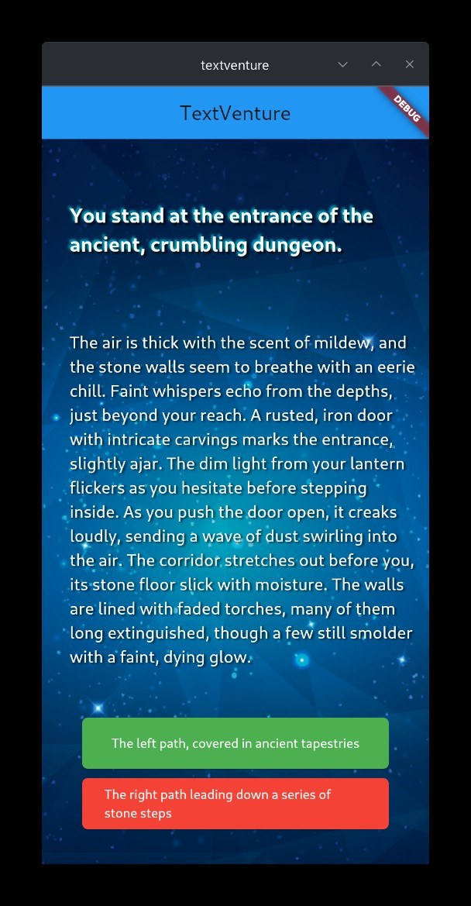

# TextVenture

A text-based adventure game built in Flutter. Explore 2 different storylines, making choices, and navigate through an interactive narrative.

---



---

## How it works

The game presents a story with 2 choices.
Players select an option, and the narrative unfolds based on their decisions.


## Requirements

    Flutter SDK (latest stable version)
    Dart 3.0 or higher

## Setup

#### Clone this repository:

```git
git clone https://github.com/yourusername/textventure.git
```

#### Install dependencies:
```
flutter pub get
```
#### Run the game:
```
flutter run
```

